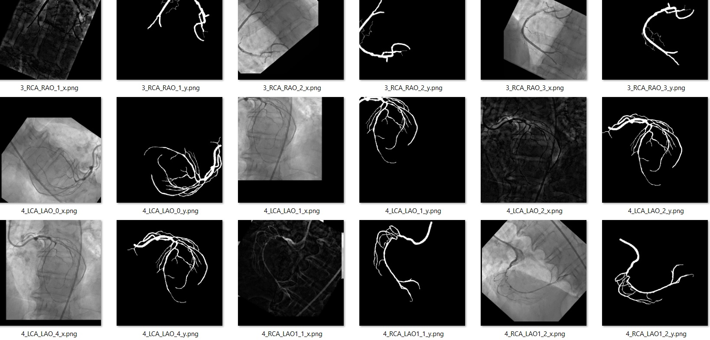
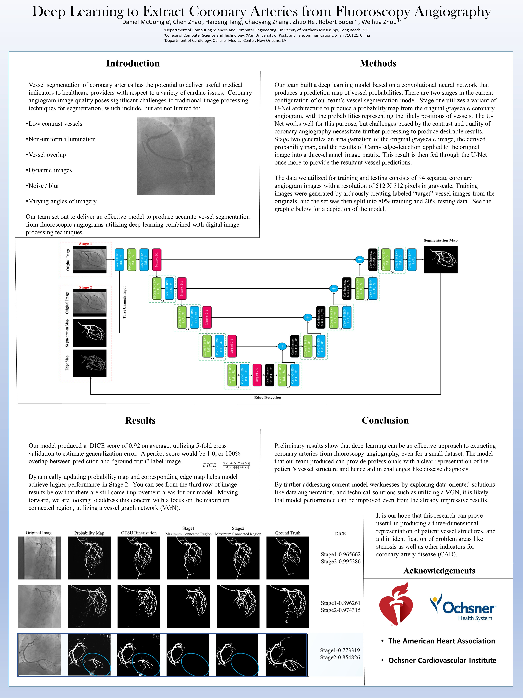

# Pytorch Image Segmentation with two-stage Mobile-U-Net

This project was created with the goal of image segmentation for fluoroscopic angiograms, and eventually semantic segmentation to identify the specific vessels.  This project was adapted from a Tensorflow version of the model, which was created by Chen Zhao (who in turn had adapted his model from George Seif's Semantic Image Segmentation Suite: https://github.com/GeorgeSeif/Semantic-Segmentation-Suite)

## Model

Stage 1: Mobile-U-Net to process the original input image, which in our case are 512 x 512 grayscale x-ray images.
Stage 2: Combine the original 512 x 512 grayscale image with the 512 x 512 segmentation prediction map from Stage 1, and a Canny edge detection of the Stage 1 output (3 channels)

### Args
Most of the command-line arguments have defaults built in, so that you can run the program with minimal specification, though I set the defaults to agree with my machine, so have a look-see.

--args(implemented so far): --gpu (which one), --gpu_4g_limit (bool; shrink model to fit 4GB GPU with batch_size 2 for 512x512 images), --data_path, --exp_name (experiment name), 
--prob_dir (directory for probability maps used in Stage 2, which are the output of Stage 1), -epochs_per_stage, --batch_size, --start_epoch, 
--validate_epoch (How often to validate training and validation images), --cv-model (MobileUNet-Skip, MobileUNet), --stage (1 or 2, or 3 for both)
Data augmentation:
--augment_data (bool; Turns on data augmentation like flip, rotate, translate, noise, tophat), --augmentation_threshold (probability to randomly perform augmentation procedures, 
--expand_dataset (multiply dataset by this number of images per real image data augmentation), --flip (bool; flips 'augmentation_threshold' % of images), 
--rotate (bool; rotates 'augmentation_threshold' % of images), --translate (bool; translates 'augmentation_threshold' % of images), 
--tophat (bool; tophats or bottomhats 'augmentation_threshold' % of images), --noise (bool; adds s&p or gaussian noise to 'augmentation_threshold' % of images), 

### Speaking of Data Augmentation, here is an example:

### Data

I know we're using Pytorch here, but my data loader is a user-defined implementation of open-cv, which loads the data as Numpy ndarrays.  I may implement Pytorch's dataloader in the future.
The trickiest part of working with arrays is typically the sizing and dimensions, so I took care to comment very thoroughly what was happening in the model, and what dimensions/shapes each function expects.  Don't hesitate to ask me if there is anything unclear to you.

### Modules needed

numpy, cv2 (opencv), tqdm, skimage, scikit-learn, scipy, psutil, torch

## More information:

### Contact information

Dan McGonigle
dpmcgonigle@gmail.com
